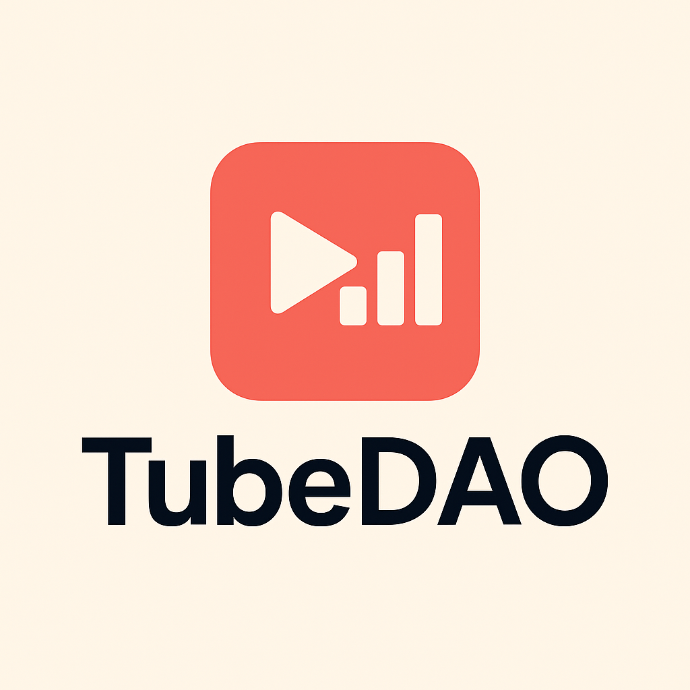

# Datomacy

  

**Own Your YouTube Data. Unlock the Deepest YouTube Insights.**

Datomacy is the first YouTube Premium Data DAO built on the Vana ecosystem. We're turning your everyday YouTube viewing behavior into user-owned data that powers ethical advertising insights and better content strategies.

## What is Datomacy?

Datomacy enables YouTube users to contribute their behavioral data while maintaining complete privacy and control. Through our privacy-first approach, users can:

- **Export & Contribute** their YouTube viewing history via Google Takeout
- **Capture Real-Time Insights** using our Chrome extension for deep behavioral analytics
- **Participate in Governance** through DAO voting on how data is licensed and used
- **Earn Tokens** when their anonymized insights are licensed to AI companies, researchers, and media labs

## Why It Matters

Your YouTube data is incredibly valuable - from viewing patterns and ad interactions to content preferences and engagement signals. Instead of tech giants monetizing this data without your knowledge, Datomacy puts you in control.

**Zero-Knowledge Powered**: Not even Datomacy sees your raw files. Your data remains private until you choose to contribute.

**User-Owned**: You decide when, how, and to whom your data insights are shared.

**DAO Governed**: Community votes on data usage policies and licensing decisions.

## The Vision

We're building a future where users own their digital footprint and benefit from the insights their behavior generates. TubeDAO represents the next generation of data ownership - transparent, user-controlled, and collectively governed.

---

**Ready to take back control of your YouTube data?** Visit [tube-dao.vercel.app](https://tubedao.org/) to join the movement.
